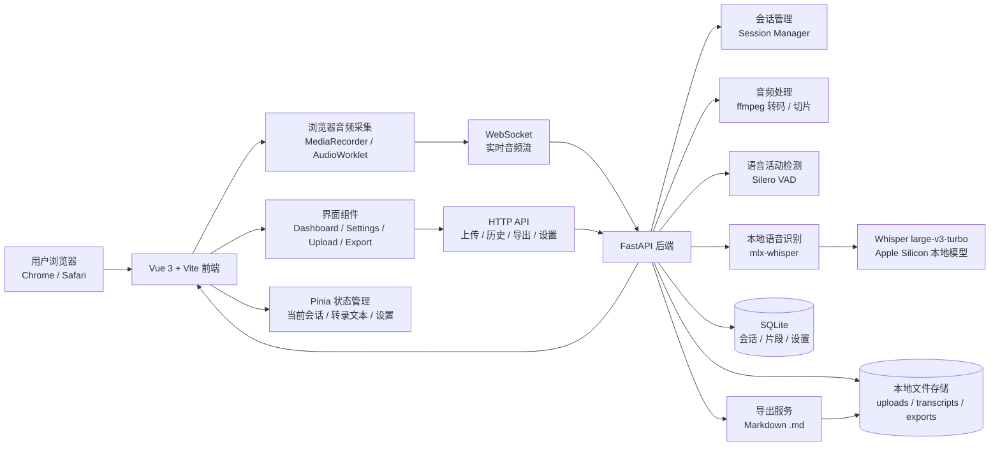
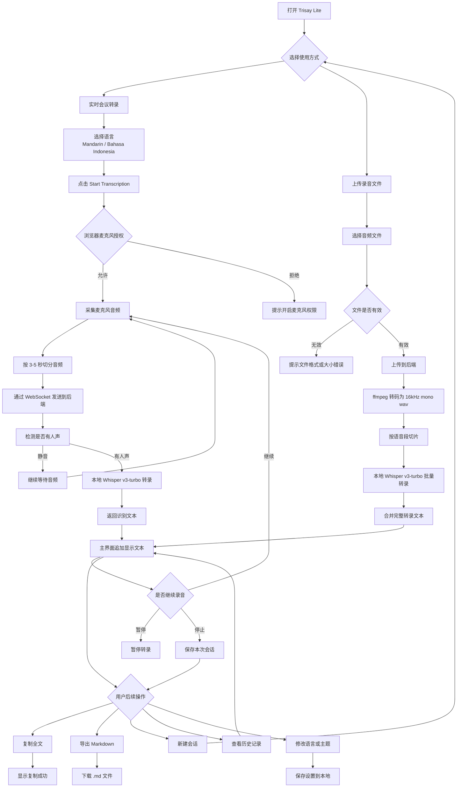
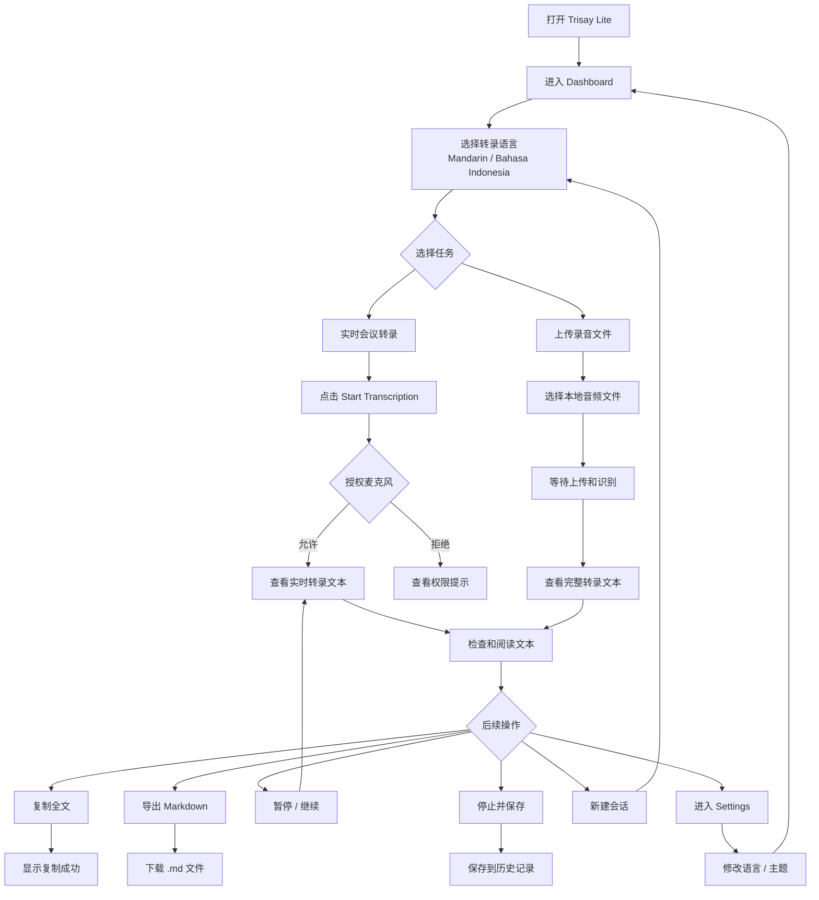
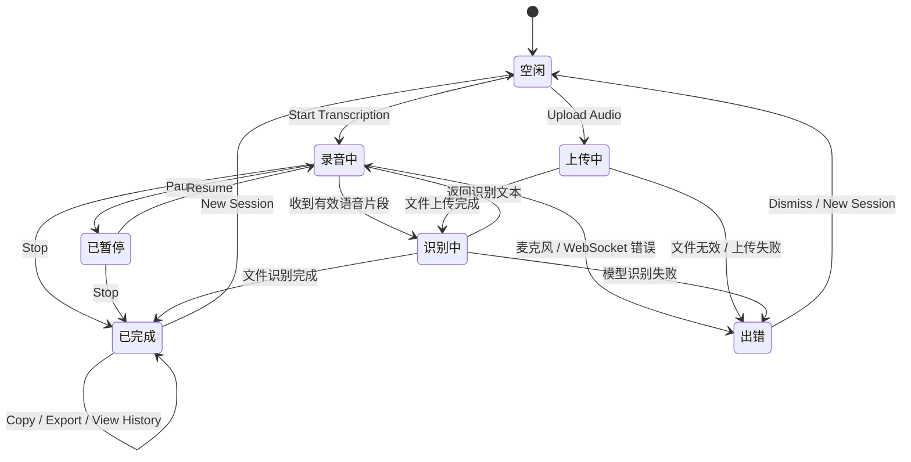
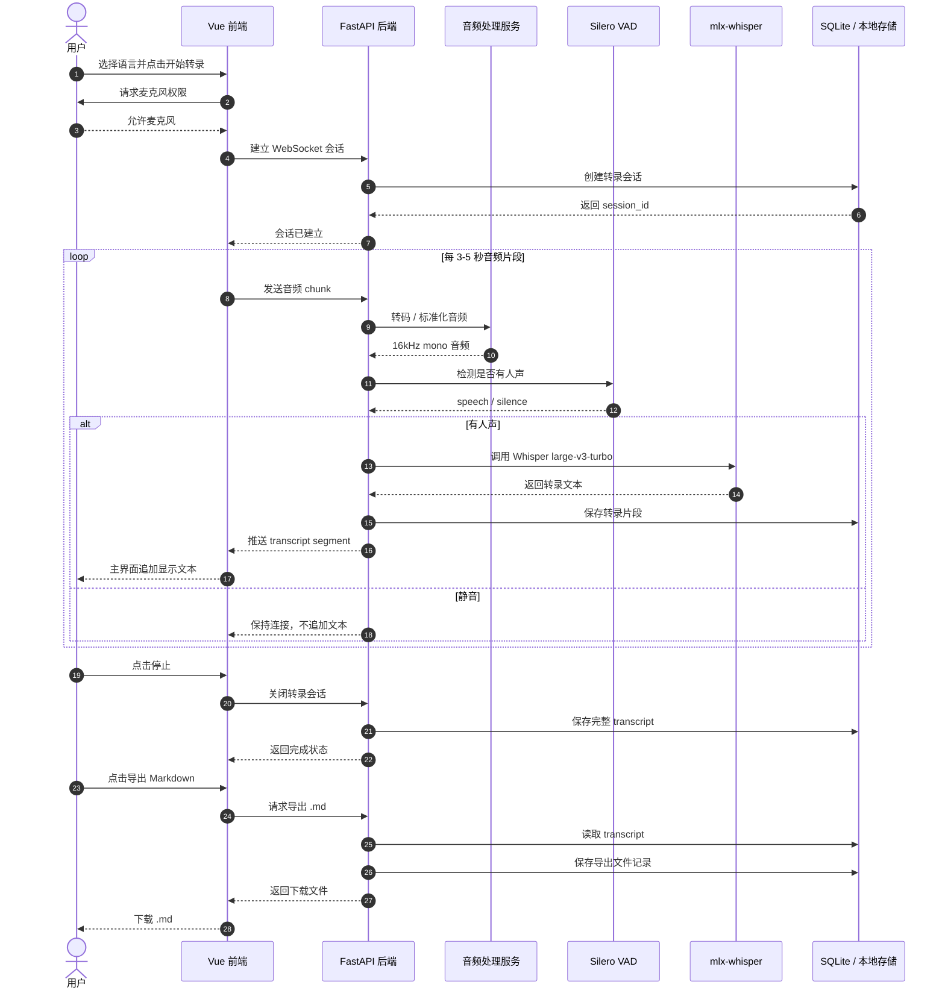

# Trisay Lite

Trisay Lite 是一个面向会议场景的本地语音转录 Web 应用方案。目标是支持中文普通话和 Bahasa Indonesia，提供实时麦克风转录、上传录音文件转录、复制全文、导出 Markdown、历史记录和基础设置能力。

本方案优先使用本地模型，适配 Apple Silicon 设备：

- 前端：Vue 3 + Vite + Tailwind CSS + Pinia + Vue Router
- 后端：FastAPI + WebSocket
- 本地模型：Whisper large-v3-turbo
- Apple Silicon 推理：mlx-whisper
- 音频处理：ffmpeg
- 静音检测：Silero VAD
- 本地存储：SQLite + 本地文件目录

## 1. 技术架构图



## 2. 业务系统流程图



## 3. 用户操作流程图



## 4. 转录状态流转图



## 5. 前后端时序图



## MVP 范围建议

第一版建议优先完成：

- Dashboard 主界面
- Mandarin / Bahasa Indonesia 语言切换
- 麦克风准实时转录
- 上传录音文件转录
- 暂停、停止、新建会话
- 复制全文
- 导出 Markdown
- Settings 页面保存语言和主题偏好
- SQLite 保存历史记录

暂缓功能：

- 用户账号
- 云端同步
- 多人说话人分离
- 自动摘要
- 翻译

## 6. 本地发布版启动

开发模式可以继续使用 Vite 和 FastAPI 两个服务。日常使用时可以构建前端生产文件，并让 FastAPI 直接托管页面：

```bash
cd /Users/vtl/project/codex/trisay_lite/frontend
npm run build
```

构建完成后，只需要启动后端：

```bash
cd /Users/vtl/project/codex/trisay_lite
scripts/start_trisay.sh
```

然后打开：

```text
http://127.0.0.1:8000
```

也可以用 macOS 启动器：

```bash
cp -R "macos/Trisay Lite.app" /Applications/
```

复制后可通过 Spotlight 搜索 `Trisay Lite` 启动。启动器会检查 `127.0.0.1:8000` 是否已有服务；没有运行时会启动后端，并自动打开浏览器。
