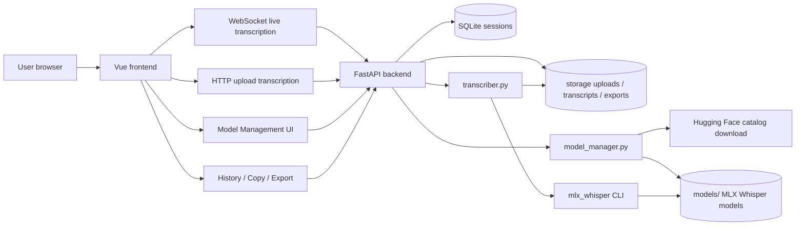

# Trisay Lite

Trisay Lite 是一个本地运行的语音转录 Web 应用。它面向会议、通话和本地媒体文件转录，优先适配 Apple Silicon Mac，通过本地 MLX Whisper 模型完成识别，不把音频上传到云端服务。

当前功能包括：

- 实时麦克风转录
- 上传音频或视频文件转录
- Auto / Mandarin / Bahasa Indonesia 语言模式
- 带时间戳的转录文本
- 中文简繁转换为简体
- 重复片段和异常压缩片段过滤
- 转录置信度、处理时间等 Media Info 指标
- 历史记录查看、删除、复制全文、导出 Markdown
- 模型管理：下载、导入本地模型、Start / Stop / Delete
- Light / Dark 主题
- FastAPI 托管生产前端
- macOS `.app` 启动器和 shell 启停脚本

## 技术栈

- Frontend: Vue 3 + Vite + TypeScript + lucide-vue-next
- Backend: FastAPI + WebSocket + SQLite
- Transcription: `mlx-whisper` CLI
- Model runtime: MLX models for Apple Silicon
- Local storage: SQLite + local file directories
- Packaging helper: macOS app launcher + shell scripts

## 目录结构

```text
trisay_lite/
  backend/
    app/
      main.py             # FastAPI API, WebSocket, upload, export, static frontend
      transcriber.py      # mlx_whisper invocation, cleanup, timestamps, metrics
      model_manager.py    # model catalog, download, local import, start/stop/delete
      database.py         # SQLite session storage
      paths.py            # project paths
    pyproject.toml

  frontend/
    src/
      App.vue             # main application UI and client state
      style.css           # responsive light/dark UI styles
      main.ts
    package.json
    dist/                 # production build, ignored by git

  scripts/
    start_trisay.sh       # start local backend on 127.0.0.1:8000
    stop_trisay.sh        # stop local backend on port 8000
    open_trisay.sh        # start then open browser

  macos/
    Trisay Lite.app/      # local app launcher

  models/                 # local Whisper models, ignored by git
  storage/                # SQLite, uploads, transcripts, exports, logs; ignored by git
  test/                   # local test media; ignored by git
  trisay_lite_architecture.html
```

## 架构



## 环境要求

Recommended:

- Apple Silicon Mac: M2 / M3 / M4
- Python 3.12+
- Node.js 20+
- `ffmpeg` / `ffprobe` available in PATH
- Local MLX Whisper model under `models/`

Backend Python dependencies are declared in:

```text
backend/pyproject.toml
```

Frontend dependencies are declared in:

```text
frontend/package.json
```

## 本地开发启动

Backend:

```bash
cd /Users/vtl/project/codex/trisay_lite/backend
.venv/bin/uvicorn app.main:app --host 127.0.0.1 --port 8000 --reload
```

Frontend:

```bash
cd /Users/vtl/project/codex/trisay_lite/frontend
npm run dev
```

然后打开 Vite 提示的地址，通常是：

```text
http://127.0.0.1:5173
```

## 日常使用启动

先构建前端生产文件：

```bash
cd /Users/vtl/project/codex/trisay_lite/frontend
npm run build
```

然后从项目根目录启动后端。FastAPI 会直接托管 `frontend/dist`：

```bash
cd /Users/vtl/project/codex/trisay_lite
./scripts/start_trisay.sh
```

打开：

```text
http://127.0.0.1:8000
```

停止服务：

```bash
./scripts/stop_trisay.sh
```

## macOS App 启动器

可以把启动器复制到 Applications：

```bash
cd /Users/vtl/project/codex/trisay_lite
cp -R "macos/Trisay Lite.app" /Applications/
```

之后可以通过 Spotlight 搜索 `Trisay Lite` 启动。

当前 `.app` 启动器只是包装本地服务和浏览器：

- 如果 `127.0.0.1:8000` 没有服务，会启动 FastAPI 后端。
- 如果服务已经运行，会直接打开浏览器。
- 日志写入 `storage/logs/`。

注意：当前脚本仍使用本机项目路径，适合本机日常使用。若要分发给其他 Mac 用户，需要把启动脚本改成可移植路径或制作正式安装包。

## 模型管理

Settings -> Model Management 提供两个来源：

- Catalog: 从 Hugging Face 下载已配置模型。
- Local: 选择本地模型目录并导入到 `models/`。

当前 catalog:

- `Whisper Large V3 Turbo`
  - `mlx-community/whisper-large-v3-turbo`
  - Recommended for live transcription on Apple Silicon.
- `Whisper Large V3`
  - `mlx-community/whisper-large-v3-mlx`
  - Recommended for uploaded media and higher accuracy.

模型状态：

- `Installed`: 模型目录存在，并且包含 `config.json`。
- `Selected`: 当前正在使用的模型。
- `Start`: 选择该模型作为转录模型。
- `Stop`: 取消当前 selected 模型。
- `Delete`: 删除本地模型目录。

如果已经有模型 selected，启动另一个模型前需要先 Stop 当前模型。

本地模型目录通常至少需要：

- `config.json`
- `weights.safetensors`
- tokenizer / preprocessor 相关文件，视模型包而定

`README.md` 和 `.gitattributes` 通常不是推理必需文件。

## 数据存储

所有运行时数据都保存在本地：

```text
storage/
  trisay_lite.sqlite3     # sessions table
  uploads/                # uploaded media and live snapshots
  transcripts/            # mlx_whisper JSON output and cleaned transcript payloads
  exports/                # exported Markdown
  logs/                   # launcher/backend logs
  model_settings.json     # selected model id
```

`models/`, `storage/`, `test/`, `frontend/dist/`, `backend/.venv/`, `frontend/node_modules/` 都被 `.gitignore` 忽略，不会提交到 GitHub。

## API 概览

Core:

- `GET /health`
- `GET /sessions`
- `GET /sessions/{session_id}`
- `DELETE /sessions/{session_id}`
- `POST /transcriptions/upload`
- `WebSocket /transcriptions/live?language=auto|zh|id`
- `GET /exports/markdown/{session_id}`

Model management:

- `GET /models`
- `GET /models/local`
- `POST /models/{model_id}/download`
- `POST /models/{model_id}/select`
- `POST /models/{model_id}/stop`
- `DELETE /models/{model_id}`
- `POST /models/local/import`

## 当前已知限制

- 实时转录目前会累积浏览器录音片段并发送快照，长时间录音会变慢，可能触发 timeout。
- 实时模式固定每个 chunk 的后端转录超时为 120 秒；`large-v3` 更适合上传文件，不适合实时。
- Hugging Face 下载器比较基础，没有断点续传、校验和和多次自动重试。
- 本地模型导入会通过浏览器上传目录到本机后端，大模型导入时可能有内存和浏览器确认弹窗问题。
- 部分历史实时 session 可能因为浏览器或后端异常退出而停留在 `processing` 状态。
- 目前没有正式自动化测试。

## 验证命令

Backend syntax check:

```bash
cd /Users/vtl/project/codex/trisay_lite
backend/.venv/bin/python -m compileall backend/app
```

Frontend build:

```bash
cd /Users/vtl/project/codex/trisay_lite/frontend
npm run build
```

Health check:

```bash
curl -s http://127.0.0.1:8000/health
```

Expected:

```json
{"status":"ok"}
```
